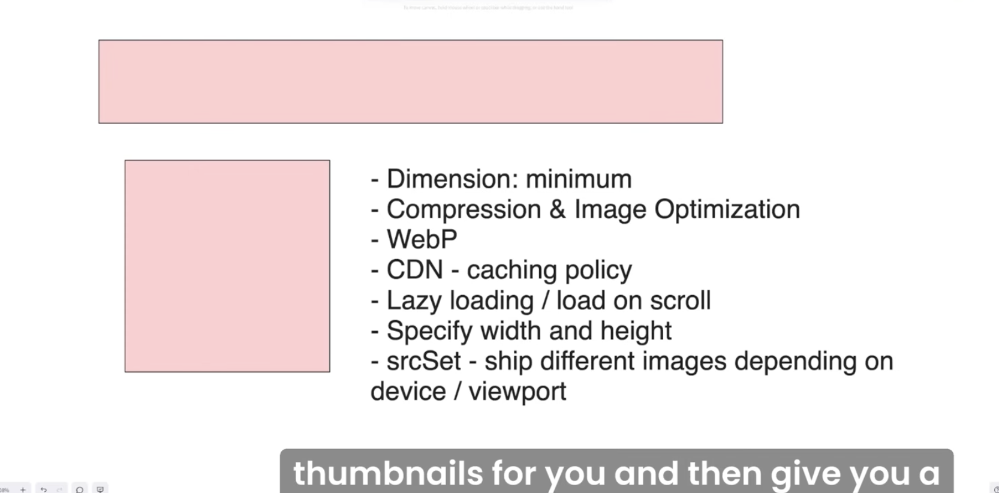

The Most Popular Cache Eviction Strategies Explained.

Caching stands out as one of the most used techniques to boost performance due to its simplicity and wide range of use cases.

How data is updated and cleared is a key component of the design of any caching strategy.

There are many techniques to choose from, all with their own unique set of use cases that they aim to accommodate.

𝗟𝗲𝗮𝘀𝘁 𝗥𝗲𝗰𝗲𝗻𝘁𝗹𝘆 𝗨𝘀𝗲𝗱 (𝗟𝗥𝗨)
↳ Common approach to cache management that deletes the oldest unused data to make room for new content. It operates on the premise that data accessed recently will likely be needed again soon.

𝗠𝗼𝘀𝘁 𝗥𝗲𝗰𝗲𝗻𝘁𝗹𝘆 𝗨𝘀𝗲𝗱 (𝗠𝗥𝗨)
↳ The opposite of LRU, where the most recently used data is removed first. This approach is more commonly used in streaming or batch-processing platforms where data is unlikely needed again once it has been used.

𝗟𝗲𝗮𝘀𝘁 𝗙𝗿𝗲𝗾𝘂𝗲𝗻𝘁𝗹𝘆 𝗨𝘀𝗲𝗱 (𝗟𝗙𝗨)
↳ Removes data that is used the least. Although it is a more accurate approach than LRU, it requires a mechanism to keep count of how often data is accessed which adds complexity. It is often paired with strategies like LRU to mitigate the risk of caching stale data.

𝗧𝗶𝗺𝗲-𝗧𝗼-𝗟𝗶𝘃𝗲 (𝗧𝗧𝗟)
↳ Keeps the data in the cache for a pre-defined period of time. This is ideal for cases where the current state of data is only valid for a certain period of time, such as session data.

𝗧𝘄𝗼-𝘁𝗶𝗲𝗿𝗲𝗱 𝗰𝗮𝗰𝗵𝗶𝗻𝗴
↳ Provides a more complex approach that strikes a balance between speed and cost. In this design, data is split up between a fast, costly tier for popular data and a slower, economical tier for less accessed data.

Other notable mentions:

• 𝗙𝗶𝗿𝘀𝘁 𝗜𝗻, 𝗙𝗶𝗿𝘀𝘁 𝗢𝘂𝘁 (𝗙𝗜𝗙𝗢): The oldest data is deleted first.

• 𝗥𝗮𝗻𝗱𝗼𝗺 𝗥𝗲𝗽𝗹𝗮𝗰𝗲𝗺𝗲𝗻𝘁 (𝗥𝗥): Randomly selects data to be deleted.

• 𝗔𝗱𝗮𝗽𝘁𝗶𝘃𝗲 𝗥𝗲𝗽𝗹𝗮𝗰𝗲𝗺𝗲𝗻𝘁 𝗖𝗮𝗰𝗵𝗲 (𝗔𝗥𝗖): Uses a self-tuning algorithm that tracks recency and frequency to determine which data to delete first.

The best caching strategy depends on the system’s specific requirements and constraints.

💬 What else would you add? ↓

~~
Thanks to our partner Augment Code who keeps our content free to the community.

𝗙𝗿𝘂𝘀𝘁𝗿𝗮𝘁𝗲𝗱 𝘄𝗶𝘁𝗵 𝗔𝗜 𝗰𝗼𝗱𝗶𝗻𝗴 𝘁𝗼𝗼𝗹𝘀 𝘀𝘁𝗿𝘂𝗴𝗴𝗹𝗶𝗻𝗴 𝗼𝗻 𝗹𝗮𝗿𝗴𝗲𝗿 𝗰𝗼𝗱𝗲𝗯𝗮𝘀𝗲𝘀? Augment Code fixes that. 

Try out their VS Code extension: https://lnkd.in/gA9tHmzc

